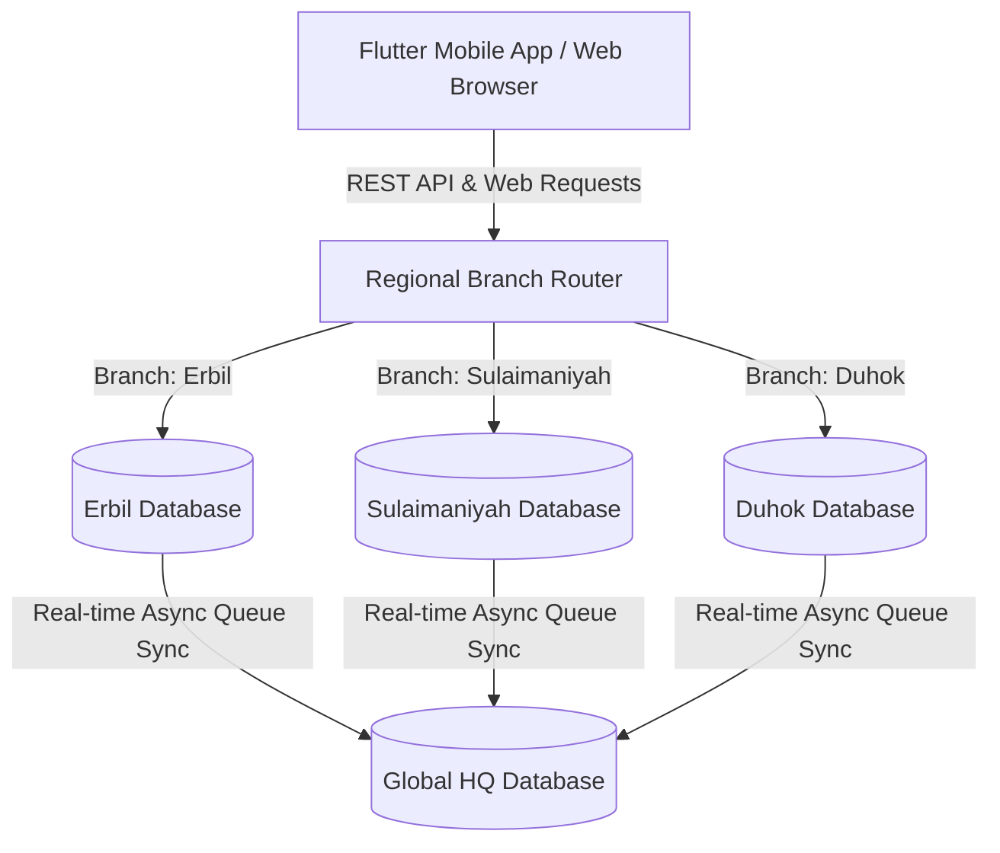

# Distributed Bank — Premium Digital Banking Platform

Distributed Bank is a highly secure, state-of-the-art digital banking platform designed for modern banking networks. The system features a **Laravel 11 backend** serving as both a web portal and a RESTful API v1 gateway, alongside a **cross-platform Flutter mobile client**. 

Built with a distributed multi-city database architecture simulating regional branch database routing (Erbil, Sulaimaniyah, Duhok) and asynchronous global database replication (HQ sync), Distributed Bank features robust bank security protocols including strict multi-document KYC validation, stateless Google 2FA, escrow P2P transfers, loan servicing, and smart card management.

---

## 📐 System Architecture Overview

Distributed Bank simulates a modern distributed banking infrastructure where data is partitioned regionally to reduce latency and maintain high availability:



*   **Branch Routing**: User transactions are processed on regional databases based on their branch registration, preventing cross-branch query congestion.
*   **Asynchronous HQ Replication**: Transactions are instantly queued on branch databases and synced to the central HQ database using Laravel's queue workers (`SyncToHqJob`).
*   **Central Audit Logs**: Every critical action (transfers, card orders, logins, profile shifts) generates central audit trails for banking compliance.

---

## 💻 System Requirements

To run this platform, you must meet the following hardware/software requirements:

### Backend Platform (Laravel 11)
| Requirement | Minimum Version | Recommended Version | Purpose |
| :--- | :--- | :--- | :--- |
| **PHP** | `8.2.x` | `8.3.x` | Core application framework execution |
| **Composer** | `2.6.x` | `2.7.x+` | Backend PHP package management |
| **Node.js** | `18.x` | `20.x+` | Asset building & compiling (Vite) |
| **npm** | `9.x` | `10.x+` | Frontend package manager |
| **MySQL** | `8.0` | `8.0+` | Regional multi-city distributed database |

### Mobile Client (Flutter)
| Requirement | Minimum Version | Recommended Version | Purpose |
| :--- | :--- | :--- | :--- |
| **Flutter SDK** | `3.19.0` | `3.22.0+` | Cross-platform UI toolkit |
| **Dart SDK** | `3.3.0` | `3.4.0+` | Application logic execution |
| **Java SDK (JDK)**| `17` | `17` | Android application compiling |
| **Android SDK** | API 21 (Lollipop) | API 34 (Upside Down Cake)| Android emulator & SDK targets |
| **Xcode** | `15.0` | `15.3+` | iOS builds (macOS only) |

---

## 🛠️ Installation & Setup Guide

### Part 1: Backend Web App & REST API Gateway

Follow these steps in your command line in the project's root folder:

#### 1. Install Backend Dependencies
```bash
composer install
npm install
```

#### 2. Configure Environment Files
Duplicate the `.env.example` to `.env` and generate the encryption key:
```bash
cp .env.example .env
php artisan key:generate
```

#### 3. Initialize Regional Databases & Run Database Seeds
Start XAMPP MySQL (or your native MySQL server) and create the 4 required databases (e.g. via phpMyAdmin or your SQL client):
```sql
CREATE DATABASE distributed_bank_hq;
CREATE DATABASE distributed_bank_erbil;
CREATE DATABASE distributed_bank_sulaimaniyah;
CREATE DATABASE distributed_bank_duhok;
```

Once the databases are created, migrate and seed all connections with:
```bash
php artisan migrate:fresh --seed
```
*This command automatically initializes the schemas and populates the seeded database models across all 4 connections.*

#### 4. Compile Asset Bundles (Vite)
Compile UI components and the Glassmorphism stylesheet bundle:
```bash
# For local dynamic development:
npm run dev

# For static production compile:
npm run build
```

#### 5. Fire Up Application Server Instances
For full functionality (including background database replication and notifications processing), run both instances concurrently:

*   **Terminal 1 (Web Server)**:
    ```bash
    php artisan serve
    ```
*   **Terminal 2 (Queue Worker)**:
    ```bash
    php artisan queue:work
    ```

---

### Part 2: Flutter Mobile Application Client

Navigate to the `mobile/` subfolder in your command line to run the app:

#### 1. Install Mobile Packages
```bash
flutter pub get
```

#### 2. Configure Server API Connection IP
Open [api_client.dart](file:///c:/Users/aland/.gemini/antigravity/scratch/digital_bank/mobile/lib/core/network/api_client.dart#L12) (or your environment file) and set the `baseUrl` targeting your server. 

> [!TIP]
> *   **Android Emulator**: Set baseUrl to `http://10.0.2.2:8000/api/v1` (bridges the emulator to your localhost server).
> *   **iOS Simulator**: Set baseUrl to `http://127.0.0.1:8000/api/v1`.
> *   **Physical Testing Device**: Use your computer's local network IP address (e.g. `http://192.168.1.100:8000/api/v1`), ensuring both devices are on the same Wi-Fi.

#### 3. Run the Mobile Client
Launch a connected simulator or physical device, then run:
```bash
flutter run
```

---

## 🔑 Demo Access Accounts

You can log in directly using the following seeded configurations:

### 1. Super Administrator (Core Control Console)
*   **Email**: `admin@distributedbank.com`
*   **Password**: `Admin@123456`
*   *Permissions*: View overall reserve health ratios, review and approve/reject pending KYC documents, authorize card requests, and adjust central banking limits.

### 2. Verified Customer — Erbil Branch
*   **Email**: `karwan@demo.com`
*   **Password**: `Demo@12345`
*   *Name*: Karwan Ahmad
*   *Status*: Fully active with USD savings & checking accounts, active debit card, and active loan.

### 3. Verified Customer — Sulaimaniyah Branch
*   **Email**: `shilan@demo.com`
*   **Password**: `Demo@12345`
*   *Name*: Shilan Ali
*   *Status*: Fully active with USD savings & business accounts, active debit card.

### 4. Unverified Customer — Duhok Branch
*   **Email**: `heman@demo.com`
*   **Password**: `Demo@12345`
*   *Name*: Heman Barzan
*   *Status*: Registered, pending KYC verification. Cannot order cards until identity documents are submitted and approved.

---

## 🔒 Platform Security & Compliance Workflows

### 📄 1. Strict Multi-Document KYC Verification
To protect against banking fraud, a user is locked out of core features (like ordering cards or disbursing high-limit funds) until they complete KYC verification.
*   **Requirements**: Users must upload **both** a verified **Passport** and a verified **National ID Card**.
*   **User Action**: Upload documents and enter document IDs from their mobile client or web profile edit page.
*   **Admin Action**: The admin views pending uploads in the web control panel (`http://localhost:8000/admin/kyc`) and clicks **Verify** or **Reject** (requiring a rejection reason).
*   **Dynamic Client Refreshes**: Once the admin processes documents, the mobile client immediately updates its global state via standard auth status triggers on return navigations, updating the user's local dashboard state in real time.

### 🔐 2. Stateless Google 2FA (TOTP)
For secure logins and transactions, Distributed Bank features Google Authenticator integration:
*   **Flow**: Enabled directly from the profile tab. The server generates a unique stateless base32 secret and QR endpoint.
*   **Authentication**: The user binds the secret to their Google Authenticator app and inputs the correct 6-digit dynamic key. The system validates the code instantly using standard state-free Laravel Sanctum security routines.

### 💸 3. Escrowed P2P Transfers
Traditional instant transfers are vulnerable to errors. Distributed Bank secures transfers via escrow routing:
*   **Acceptance Loop**: Transfers are initialized as `pending_acceptance`.
*   **Recipient Interaction**: Recipient receives a real-time notification alert and must navigate to their **Convert / Pending Tab** to click **Accept** (which clears and deposits funds instantly) or **Decline** (which returns funds to the sender's account).

---

## 🌍 Localization & Premium Aesthetics
*   **Full CKB / EN Localizer**: Dynamically toggles languages between **English (EN)** and **Kurdish - Sorani (CKB)**. The system dynamically shifts layout orientations (LTR / RTL) on the fly based on localization parameters.
*   **Glassmorphism Theme Selector**: Web and mobile apps feature a custom frosted dark glass visual palette (default) and standard light theme modes.

---

*Developed by Advanced Agentic Coding for robust, premium, high-integrity banking applications.*
